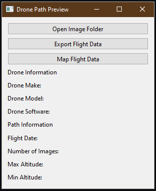

# Drone Path Preview
A simple tool of previewing the results of drone flights.

# Usage
Just point the application towards a folder containing drone images.
It will automatically retrieve the drone and flight information.

# Key Features of Drone Path Preview
- Designed to read image files collected from DJI Drones!
- Will provide you with information on flight start time, number of images, altitude.
- 'Map Flight Data' will provide a display of where images were captured.
- Can export flight information to a ESRI shapefile, geojson or any OGR data source supported by Pyogrio.
- Exported data includes coordinates, altitude, image type, and file name.

# Notes
- This is the initial release! So there may be bugs, features are slim and UI looks ugly.
- Currently tested on the DJI M3T images but may support the DJI M3M. 

# Known Issues
- The precompiled executable will not export flight data due to a GDAL issue with pyinstaller

# Requires
- geopandas
- matplotlib
- cartopy
- PIL
- shapely
- PySide6
- Pyogrio